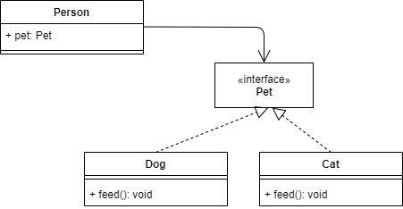

# Getting Started with Spring

In this exercise you will be introduced to the Java Programming Language.

## Aims

In this exercise, you will create a basic Spring application that uses a simple set of configured beans.

## Open the Starter Project and Review the Files
1.	Using your preferred IDE, open the project <LAB_HOME>\labs\BasicSpring.
2.	In the root directory of the project, open pom.xml (or build.gradle) and review the dependencies. You can see a dependency entry for Spring 5 Core. Close the file.
3.	Now navigate to the package com.conygre.test.pets.
4.	Review the classes that are provided. Note the relationships between Pet, Cat and Dog, and also the relationship between Pet and Person.

## Create the Configuration File
1.	Create a class in the same package as all the others called PersonConfiguration.
2.	In that class, add the annotation @Configuration to make it a configuration class.
3.	Now add in a method to configure a new Cat. The method must be annotated @Bean and simply needs to return a new Cat object. The return type must be Pet.

@Bean
public Pet pet() {
  return new Cat();
}
4.	Now add a method to configure the Person. This method is also annotated using @Bean, but this time, return a new Person that uses an injected Pet as a constructor parameter.

@Bean
public Person person(@Autowired Pet pet) {
    return new Person(pet);
}

5.	### Review the code and make sure that you understand what you have done.
Now we will create a test class that will be used to load the config file, load up the context, and then we will be able to access our beans,

6.	### Open the provided class in the default package called * **PersonTest**.
7.	### It has an empty main() method. Within main() add a line to create the context. It will look something like the below. Note you will also need to add the necessary import statements.

ApplicationContext context = new  AnnotationConfigApplicationContext(PersonConfigurer.class);

8.	### That line creates all of the beans, and you can now look them up from within the context. So now, use the context to get the Person bean that was configured earlier and then get the Pet and finally feed the Pet. This can be done in one line as shown below:

context.getBean(Person.class).getPet().feed();

9.	### Run the application, and after all of your efforts you will see. “Feed the cat”.

## Optional: Using the Annotations for configuration
Now create another similar pair of classes like Person and Address, and wire them together using the @Component annotation together with @Autowired to connect them.
You will have opportunity to use these later in the course if you don’t have time to complete this.

## Optional – Using XML for Configuration
Finally, if you have time, create an XML configuration file to wire together one of your pairs of beans from the previous exercises.

