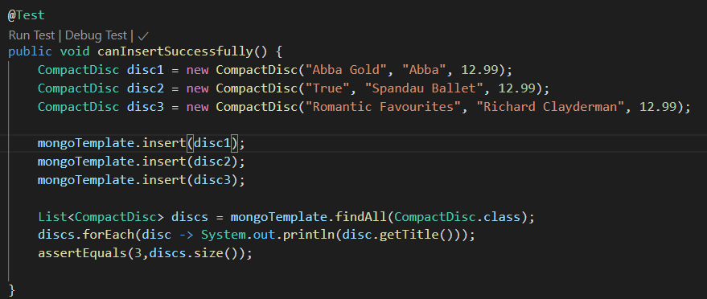
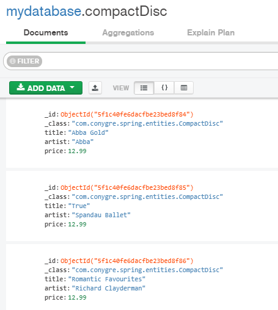

# Working with MongoDB and Spring using Grade and VS Code

## Aims
In this exercise, you will create a Spring application that uses MongoDB as the database for a service layer.

## Part 1: Configuring the Project
1.	Open a **Command Prompt** in the `<LAB_HOME>\labs\MongoDBSpring` directory.

2.	At the terminal, run the command `gradle init`.

3.	At the various prompts, provide the following information:

| Prompt | Selection |
| -- | -- |
| Type of Project |	2. Application |
| Implementation Language |	3. Java |
| Build Script DSL |	1. Groovy |
| Unit Test Framework |	1. Junit 4 |
| Project name |	Press enter to select the default |
| Source package |	com.conygre.spring |


4.	Now launch **Visual Studio Code** and open the folder. 
5.	Open the file **build.gradle**.
6.	Add the following entry to the repositories location:

```
maven { url "https://repo.maven.apache.org/maven2" }
```

7.	Locate the dependencies section and add the following:

```
compile group: 'org.springframework.data', name: 'spring-data-mongodb', version:'1.10.4.RELEASE'
    testCompile group: 'org.springframework', name: 'spring-test', version:'4.1.7.RELEASE'
``` 

## Create a Document Class
1.	In the Visual Studio file explorer, expand src/main/java and then right click on the spring directory and choose New Folder, and call the new folder entities.
2.	In the new folder, create a new file called CompactDisc.java.

 
 
3.	Add the following properties along with the get/set methods.

id	ObjectId
title	String
artist	String
price	double


4.	Add the annotation to specify that the class is a @Document.
5.	Finally, add a constructor to allow you to create a CompactDisc with a title, artist, and price (no ID), and then add a default no argument constructor.

## Setting up the Java Configuration
Initially, you will use the MongoTemplate, so a configuration file will be required.

1.	In your src/main/java/com/conygre/spring folder, create a new Java class called MongoJavaConfig.
2.	Annotate the class with @Configuration, and then ensure that the class extends AbstractMongoConfiguration.
3.	Add the following required methods:

```
@Override
protected String getDatabaseName() {
  return "mydatabase";
}

@Override
public Mongo mongo() throws Exception {
  return new MongoClient("127.0.0.1", 27017);
}  
```
## Part 2 Create a Test Class
1.	In the file explorer pane, expand `src/test/java` and within it create a new test class called `com.conygre.mongo.BasicMongoTest`.
2.	Annotate the class with the `@RunWith(SpringJUnit4ClassRunner.class`.
3.	Annotate the class with the following additional annotation:
```
@ContextConfiguration(classes = MongoJavaConfig.class, loader = AnnotationConfigContextLoader.class)
```
This will cause the test to automatically load your Java Spring configuration class.

4.	Add a private field to the test of type `MongoTemplate` and annotate it with `@Autowired`. This will then be automatically set by the SpringJUnit4ClassRunner.

5.	Add a method called `canInsertSuccessfully()` and annotate it with `@Test`.

6.	Using the `MongoTemplate` field, insert a few CompactDisc objects of your choosing into Mongo.

7.	Now retrieve all of the rows from your mongo database as a List and iterate over them displaying all of the titles.

8.	Use an `assertEquals` to ensure that the right number of rows are added, for example:

```
assertEquals(3,discs.size());
```

A complete example is shown below:

```
public void canInsertSuccessfully() {
    CompactDisc disc1 = new CompactDisc("Abba Gold", "Abba", 12.99);
    CompactDisc disc2 = new CompactDisc("True", "Spandau Ballet", 12.99);
    CompactDisc disc3 = new CompactDisc("Romantic Favourites", "Richard Clayderman", 12.99);

    mongoTemplate.insert(disc1);
    mongoTemplate.insert(disc2);
    mongoTemplate.insert(disc3);

    List<CompactDisc> discs = mongoTemplate.findAll(CompactDisc.class);
    discs.forEach(disc -> System.out.println(disc.getTitle()));
      assertEquals(3,discs.size());
 }
```

9.	Finally, we need to add some clean up to remove it all at the end of the test, otherwise, you will keep adding more rows every time! To do this, add a void method called `cleanup()` and annotate it with `@After`. This method will run after each test.

10.	Within this method, add the following code to remove the collection:

```
@After
public void cleanUp() {
    for (String collectionName : mongoTemplate.getCollectionNames()) {
        if (!collectionName.startsWith("system.")) {
            mongoTemplate.getCollection(collectionName).remove(new BasicDBObject());
        }
    }
}
```

11.	Make sure mongod.exe is running, and then test your application to ensure that they have been successfully inserted. This can be done in Visual Studio Code by clicking on the Test button above the method.



12.	Finally, to prove it worked, comment out the @After annotation on your clean up method and run it again. You will see your data in the database table using MongoDB Compass.



## Part 3 Create a Working Data Access Object
You have a basic test working that proves you can get your Java application to work with MongoDB. Now you will implement the Data Access Object pattern to create a Data access object that can be used to create/read/update/delete rows from your MongoDB collection.

1.	Open your `MongoJavaConfig.java` file and add the `@ComponentScan` annotation. This will allow for your DAO and later on, your Service class, to be created automatically.

2.	Create an interface called `com.conygre.spring.dao.CompactDiscDAO` with the following methods:

```
public interface CompactDiscDAO {
	
   void addCompactDisc(CompactDisc disc);
   CompactDisc getCompactDiscByTitle(String title);	
   Collection<CompactDisc> getDiscsByArtist(String artist);	
   Collection<CompactDisc> getAllDiscs();
}
```

3.	In the same package, create an implementation of the interface called `CompactDiscDAOMongo`, and add empty implementations of each method.

4.	Annotate the class with the spring annotation `@Repository`, since this is a data access class.

5.	Add a private field of type `MongoTemplate` and annotate that with `@Autowired`.

6.	Within each method, add the appropriate code to complete the functionality of the method using the mongoTemplate object.

A sample of the complete code is shown below:

```
package com.conygre.spring.dao;
import com.conygre.spring.entities.CompactDisc;
import org.springframework.beans.factory.annotation.Autowired;
import org.springframework.data.mongodb.core.MongoTemplate;
import org.springframework.data.mongodb.core.query.Criteria;
import org.springframework.data.mongodb.core.query.Query;
import org.springframework.stereotype.Repository;

import java.util.Collection;
import java.util.List;

@Repository
public class CompactDiscDAOMongo implements CompactDiscDAO {

@Autowired
private MongoTemplate mongoTemplate;

@Override
 public void addCompactDisc(CompactDisc disc) {      mongoTemplateinsert(disc);

  }

@Override
 public CompactDisc getCompactDiscByTitle(String title) {
  Query query = new Query();
   query.addCriteria(Criteria.where("title").is(title));
   CompactDisc disc = mongoTemplate.findOne(query, CompactDisc.class);      return disc;
    }

 @Override
 public Collection<CompactDisc> getDiscsByArtist(String artist) {     Query query = new Query();     query.addCriteria(Criteria.where("artist").is(artist));     List<CompactDisc> discs = mongoTemplate.find(query, CompactDisc.class);     return discs;
    }

@Override
public Collection<CompactDisc> getAllDiscs() {     return mongoTemplate.findAll(CompactDisc.class);
    }
}
```

## Part 4 Create the Service Layer
You will now create a sample service layer which will add CDs to the catalog and also allow users to search the catalog by title or artist. The service layer will rely on dependency injection for the DAO. 

1.	Create a new class called `com.conygre.spring.service.CompactDiscService`.

2.	Annotate the class with `@Service` so that it gets created by Spring as a component. Remember `@Service` is an alternative to `@Component`.

3.	Add a property for the DAO which will be of type `CompactDiscDAO`. Annotate it with `@Autowired` so that it gets injected.

4.	Add the following methods:
```
void addCDToCatalog(CompactDisc cd)
Collection<CompactDisc> getCatalog()
```
5.	In the `addCDToCatalog` method, pass the CompactDisc method parameter to the DAO. 

6.	In the `getCatalog` method, retrieve all the CDs from the DAO and then return them.

A complete code example is shown below:

```
package com.conygre.spring.service;


import com.conygre.spring.dao.CompactDiscDAO;
import com.conygre.spring.entities.CompactDisc;
import org.springframework.beans.factory.annotation.Autowired;
import org.springframework.stereotype.Service;
import java.util.Collection;

@Service
public class CompactDiscService {

@Autowired
 private CompactDiscDAO dao;
  public void addToCatalog(CompactDisc disc) {
   dao.addCompactDisc(disc);  }

 public Collection<CompactDisc> getCatalog() {     return dao.getAllDiscs();
  }

}
```

## Part 5 Test the Application

To test the application we will create one final Junit test case that will need to:

1.	Insert some data into MongoDB.
2.	Check to see if the application can retrieve it through the Service class.

The steps to complete this are shown below:

1.	In the `src/test/java/com/conygre/spring` folder, create a new Java class called `CompactDiscServiceTest`.

2.	We will use some Spring specific extensions to Junit here to help us. So above your class definition, add the following two annotations:

```
@RunWith(SpringJUnit4ClassRunner.class)
@ContextConfiguration(classes = MongoJavaConfig.class, loader = AnnotationConfigContextLoader.class)
```
These annotations specify that it should run with a Spring test runner, and also that it should load your configuration class, since that is where your beans have been set up.

3.	Declare a `MongoTemplate` variable called `mongoTemplate` and annotate with `@Autowired`. This will be needed to clean up our database at the end of the test.

4.	Declare a `CompactDiscService` variable called `service`. This will be the object we are going to be testing. Annotate this with `@Autowired` as well, since we can get this injected into the test by Spring.

The code should now look something like this:

```
@RunWith(SpringJUnit4ClassRunner.class)
@ContextConfiguration(classes = MongoJavaConfig.class, loader = AnnotationConfigContextLoader.class)
public class CompactDiscServiceTest {
@Autowired
 private CompactDiscService service;

 @Autowired
    private MongoTemplate mongoTemplate;
}
```

5.	Now add a test called `addCompactDiscThroughServiceLayer()`. 

6. In this test, create a new `CompactDisc` object and insert it via the `service.addToCatalog(cd)` method.
   
7.	Finally, to check it has inserted successfully you can use a `assertEquals` and call `getCatalog()` on the service to check that it now has a size of 1. See below for an example:

```
@Test
public void addCompactDiscsThroughServiceLayer() {
  service.addToCatalog(new CompactDisc("Chic", "Risque", 12.99));
  assertEquals(1, service.getCatalog().size());
}
```

8.	Add a cleanup method which is the same as the previous test, which can be used to delete the contents of the database after the test has completed.

9.	Finally, run your test. You should see success!
